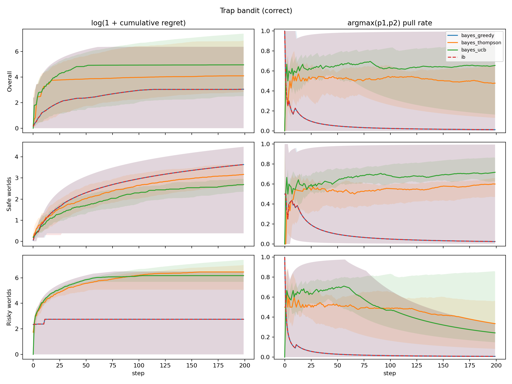
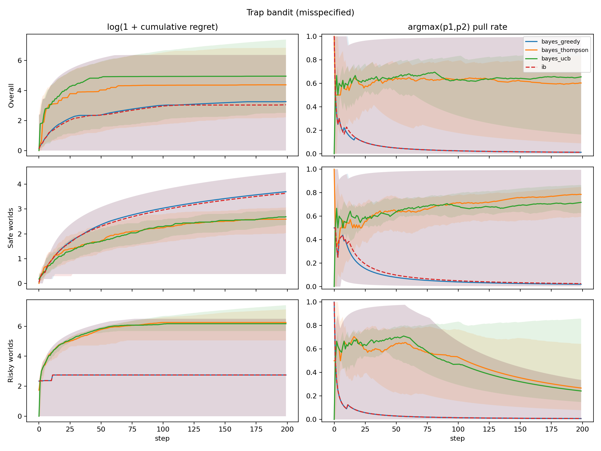
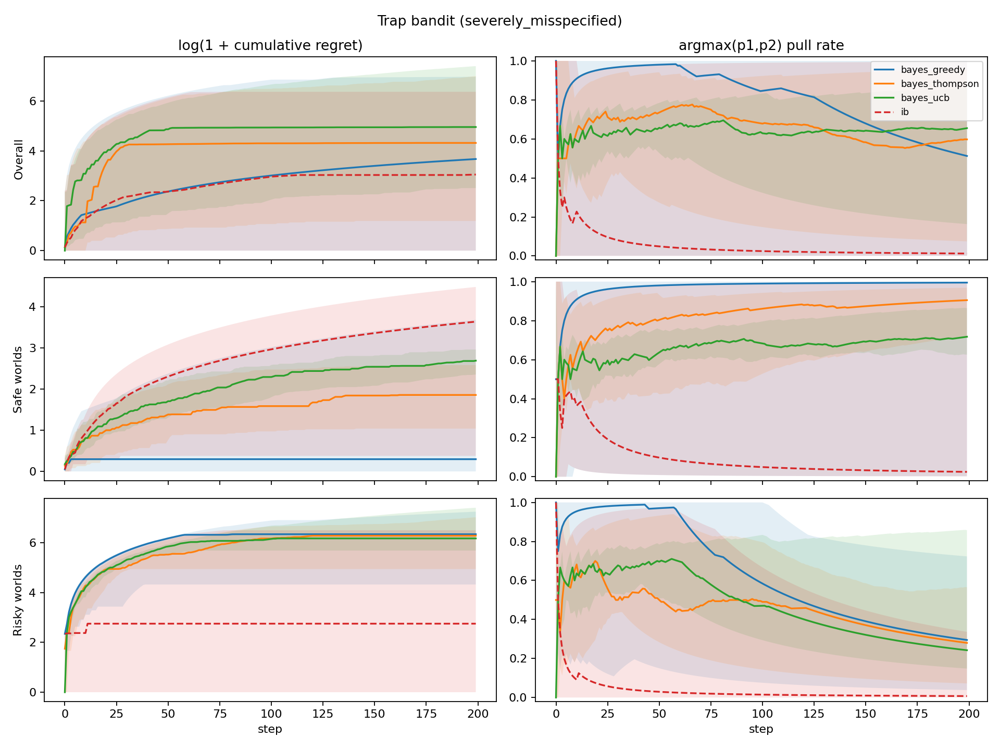
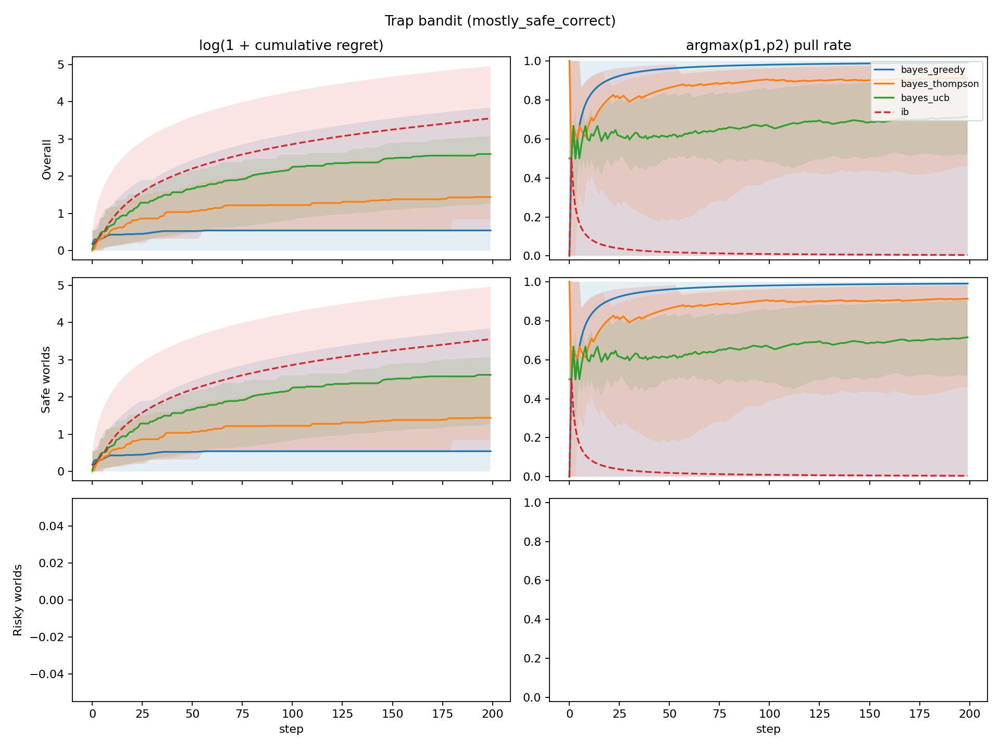

# Trap Bandit Experiment

Below we describe a simple experiment to demonstrate how a robust infra-Bayesian learner may be beneficial even in a stateless, stochastic bandit setting.

There are always `K=2` possible arms to pull. The goal of the agent is to learn which arm generates the higher expected reward and exploit that arm. There is a probability `alpha` of being in a risky world, and probability `1 - alpha` of being in a safe world.

In the safe world, each arm is Bernoulli and has fixed probability `(p_1, p_2)` of yielding reward `1`. In the risky world, the arm with the higher realized bias `p_i` is a three-sided die with a small probability `p_catastrophe` of yielding reward `-1000`; with probability `p_i`, it yields reward `1`; otherwise it yields reward `0`.

```text
sample alpha ~ Beta(2,2)
sample p1, p2 ~ Beta(2,2)
sample world_type ~ Bernoulli(alpha)

safe world:
  arm i -> Bernoulli(p_i)

risky world:
  trapped_arm = argmax(p1, p2)
  trapped_arm -> reward -1000 (catastrophe) with probability 0.01
                 reward 1 with probability p_i
                 reward 0 otherwise
  other arm   -> Bernoulli(p_i)
```

Figure 1. Hierarchical world design of possible outcomes in the experiment.

We compare classical Bayesian agents and an infra-Bayesian agent using the same joint hypothesis machinery. Bayesian agents use `Infradistribution.mix(...)`; the infra-Bayesian agent uses Knightian uncertainty over the safe-vs-risky world families via `Infradistribution.mixKU(...)`, while remaining classical/Bayesian over `p1,p2` within each family.

First, priors match the data-generating process: `alpha ~ Beta(2,2)`, `p1,p2 ~ Beta(2,2)`, and `p_catastrophe = 1/100`. Then we run a misspecified-prior condition where Bayesian agents put lower-than-actual probability on the risky world, using `alpha ~ Beta(2,5)`. The infra-Bayesian agent shares the same `p1,p2` prior but maintains Knightian uncertainty over whether the world is safe or risky.

We also include a mostly-safe correctly specified condition. Since `alpha` denotes probability of a risky world, this is implemented as `alpha ~ Beta(1,99)`, equivalent to a `Beta(99,1)` prior over being safe.

For Bayesian agents, we compare three exploration strategies:

- greedy,
- Thompson sampling,
- empirical UCB.

For the infra-Bayesian agent, we use greedy action selection over its robust lower values, with uniform tie-breaking.

Regret is measured against the best policy with full knowledge of the true world. We report cumulative expected regret percentiles and trapped-arm pull-rate percentiles.

## Preliminary Downscaled Results

The current implementation is in `experiments/alaro/trap_bandit/`. For a first artifact run, we used a downscaled configuration because the full `100 worlds x 1000 steps` run is still slow:

```text
num_worlds = 20
num_steps = 200
num_grid = 7
p_cat = 0.01
```

Generated artifacts:

- [config.json](../experiments/alaro/trap_bandit/results_small/config.json)
- raw caches: `*_raw.npz`
- [correct_summary.json](../experiments/alaro/trap_bandit/results_small/correct_summary.json)
- [misspecified_summary.json](../experiments/alaro/trap_bandit/results_small/misspecified_summary.json)
- [severely_misspecified_summary.json](../experiments/alaro/trap_bandit/results_small/severely_misspecified_summary.json)
- [mostly_safe_correct_summary.json](../experiments/alaro/trap_bandit/results_small/mostly_safe_correct_summary.json)
- [correct_grid.png](../experiments/alaro/trap_bandit/results_small/correct_grid.png)
- [misspecified_grid.png](../experiments/alaro/trap_bandit/results_small/misspecified_grid.png)
- [severely_misspecified_grid.png](../experiments/alaro/trap_bandit/results_small/severely_misspecified_grid.png)
- [mostly_safe_correct_grid.png](../experiments/alaro/trap_bandit/results_small/mostly_safe_correct_grid.png)

Each result figure has six subplots. Columns are `log(1 + cumulative expected regret)` and `argmax(p1,p2)` pull rate. Rows are overall average, safe worlds, and risky worlds.



Figure 2a. Correct-prior results.



Figure 2b. Misspecified-prior results.



Figure 2c. Severely misspecified-prior results.



Figure 2d. Mostly-safe correctly specified prior results.

Final cumulative expected-regret percentiles from this downscaled run:

| condition | agent | catastrophe rate | p5 | p50 | p95 |
| --- | --- | ---: | ---: | ---: | ---: |
| correct | bayes_greedy | 0.10 | 0.00 | 20.14 | 583.28 |
| correct | bayes_thompson | 0.40 | 15.93 | 59.14 | 942.93 |
| correct | bayes_ucb | 0.40 | 11.29 | 141.17 | 1632.10 |
| correct | ib | 0.10 | 0.00 | 20.14 | 583.28 |
| misspecified | bayes_greedy | 0.10 | 0.00 | 25.05 | 583.28 |
| misspecified | bayes_thompson | 0.45 | 8.18 | 78.89 | 938.70 |
| misspecified | bayes_ucb | 0.40 | 11.29 | 141.17 | 1632.10 |
| misspecified | ib | 0.10 | 0.00 | 20.14 | 583.28 |
| severely misspecified | bayes_greedy | 0.40 | 0.00 | 38.41 | 1065.86 |
| severely misspecified | bayes_thompson | 0.40 | 2.29 | 74.19 | 1094.63 |
| severely misspecified | bayes_ucb | 0.40 | 11.29 | 141.17 | 1632.10 |
| severely misspecified | ib | 0.10 | 0.00 | 20.14 | 583.28 |
| mostly safe correct | bayes_greedy | 0.00 | 0.00 | 0.72 | 45.60 |
| mostly safe correct | bayes_thompson | 0.00 | 1.32 | 3.22 | 11.90 |
| mostly safe correct | bayes_ucb | 0.00 | 2.56 | 12.39 | 20.46 |
| mostly safe correct | ib | 0.00 | 0.77 | 33.93 | 141.06 |

Interpretation so far: in the correct-prior and mildly misspecified conditions, the IB agent behaves very similarly to greedy Bayesian planning. Under severe misspecification (`alpha ~ Beta(1,99)` for the Bayesian prior), greedy Bayesian planning pulls the would-be trapped high-bias arm more often and suffers more catastrophes, while the IB agent remains unchanged because it keeps Knightian uncertainty over safe vs risky worlds. Thompson sampling and UCB explore more aggressively and therefore suffer more catastrophes and worse upper-tail regret across conditions.

The mostly-safe correctly specified condition shows the opposite side of the tradeoff: when the world is in fact almost always safe and the Bayesian prior knows this, Bayesian agents exploit the high-bias arm profitably, while the IB agent remains conservative because it still keeps the risky-world family live.

The trapped-arm pull-rate plots show the rate of pulling `argmax(p1,p2)`. In risky worlds this is the high-reward/high-risk arm; in safe worlds it is not actually dangerous, but it is the arm that would be trapped if the world were risky.

The runner caches raw simulation arrays as `*_raw.npz` files. Re-running the plotting command with the same config regenerates summaries and figures from cache; pass `--force` to rerun simulation.
