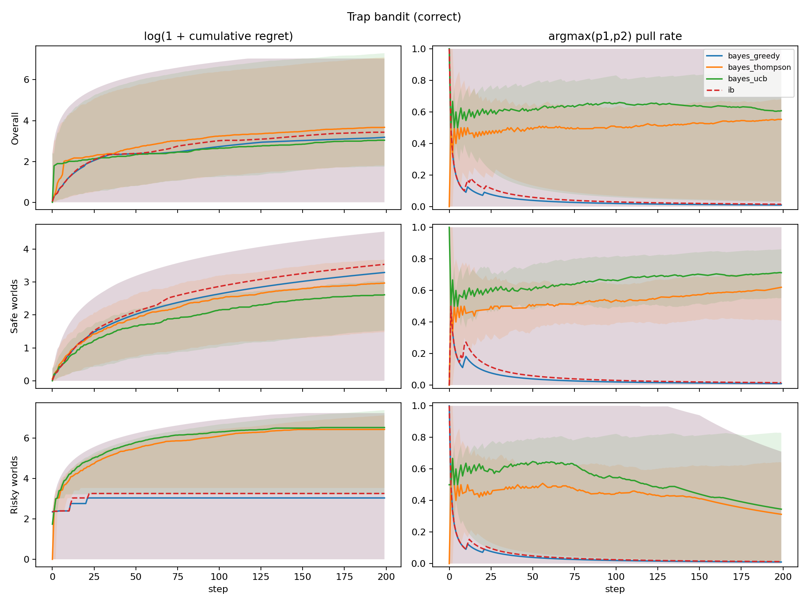
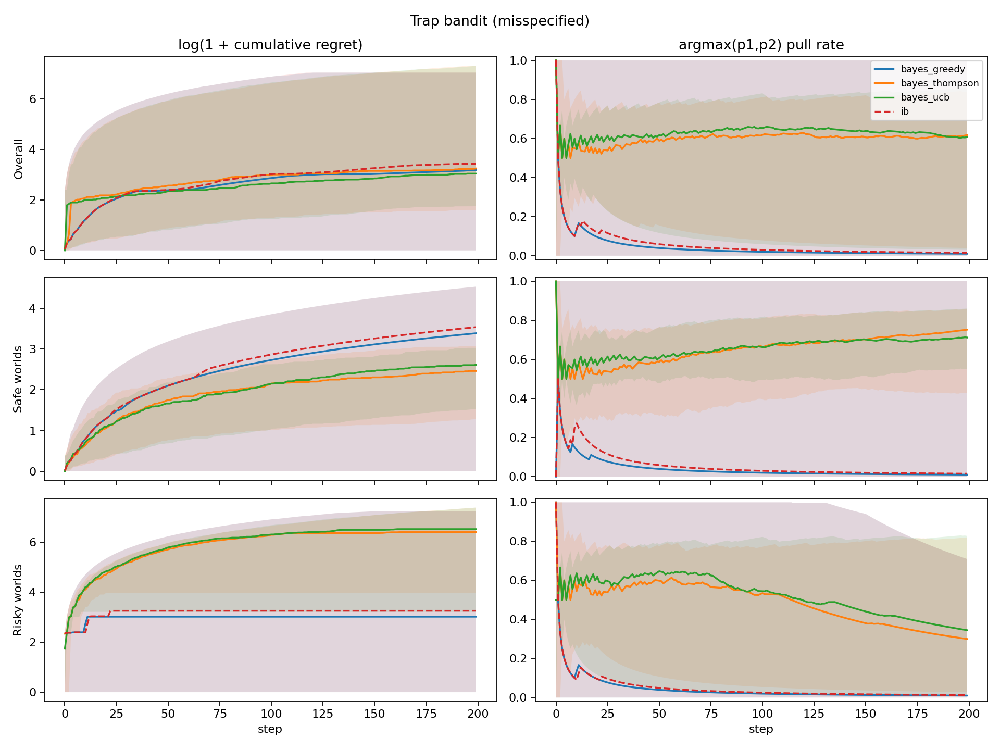
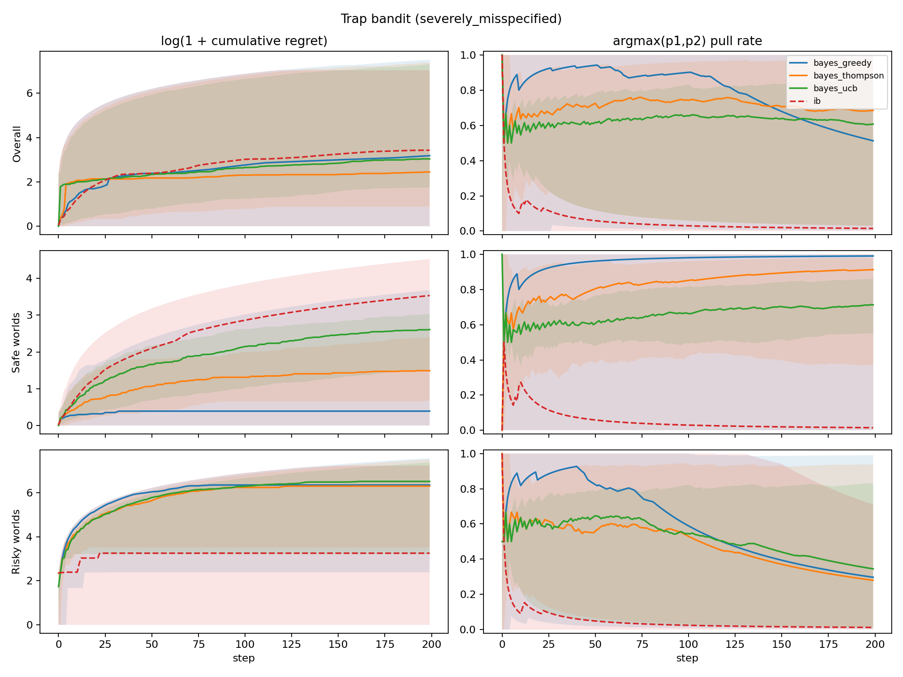
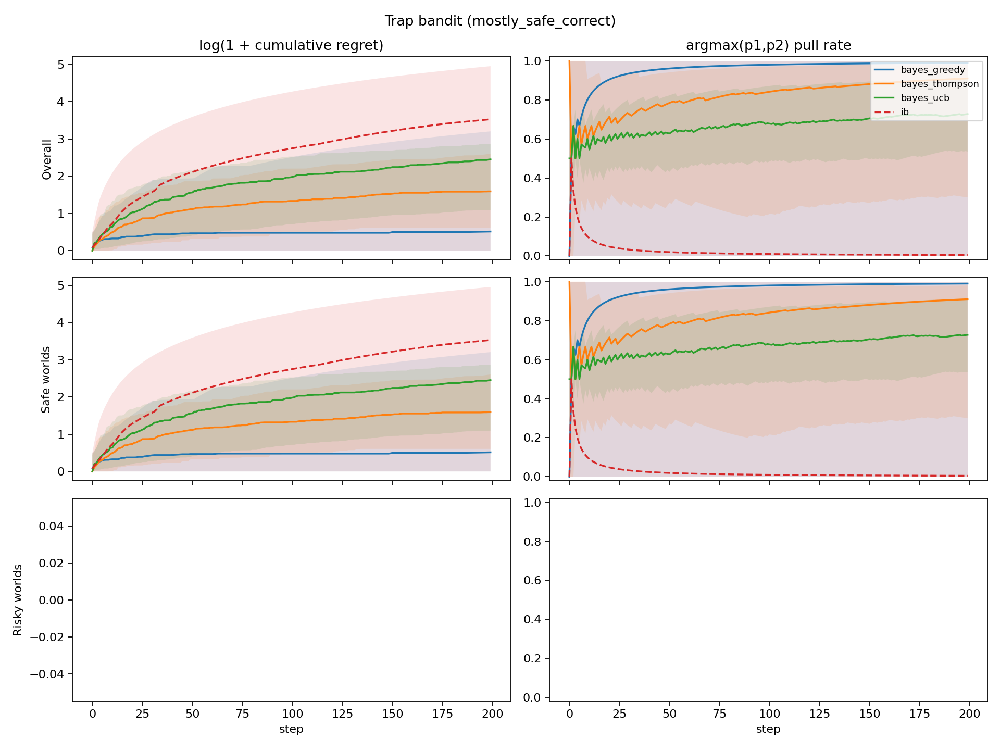

# Trap Bandit Experiment

Below we describe a simple experiment to demonstrate how a robust infra-Bayesian learner may be beneficial even in a stateless, stochastic bandit setting.

The details of our experiment are as follows. There are `K=2` possible arms to pull. There is a probability `alpha` of being in a risky world, and probability `1 - alpha` of being in a safe world.

At the beginning of a new run, p_1 and p_2 are newly sampled from a beta distribution. The world_type = {risky, safe} is also sampled.  In the safe world, each arm is Bernoulli and has fixed probability, `p_i`, of yielding reward `1`. In the risky world, the arm with the higher realized bias `p_i` is a three-sided die with a small probability `p_catastrophe` of yielding reward `-1000`; with probability `p_i`, it yields reward `1`; otherwise it yields reward `0`. The arm with the lower realized bias is still Bernoulli with reward = {1,0}.

```text
For each new run:
    sample alpha ~ Beta(2,2) or Beta(1,99)
    sample p1, p2 ~ Beta(2,2)
    sample world_type ~ Bernoulli(alpha)

    if safe world:
        arm i -> Bernoulli(p_i)

    if risky world:
        trapped_arm = argmax(p1, p2)
        trapped_arm -> reward -1000 (catastrophe) with probability 0.01
                        reward 1 with probability p_i
                        reward 0 otherwise
        other arm   -> Bernoulli(p_i)
```
Schema 1. Experiment world design.

We compare classical Bayesian agents and an infra-Bayesian agent using the same joint hypothesis machinery. Bayesian agents always use `Infradistribution.mix(...)`; the infra-Bayesian agent uses Knightian uncertainty over the safe-vs-risky world families via `Infradistribution.mixKU(...)`, while remaining classical/Bayesian (employing `Infradistribution.mix(...)`) over `p1,p2` within each family.

In the first experiment, all Bayesian priors match the data-generating process: `alpha ~ Beta(2,2)` and `p1,p2 ~ Beta(2,2)`. In the second and third experiments, we run increasingly misspecified-prior conditions where Bayesian agents put lower-than-actual probability on the risky world, using `alpha ~ Beta(2,5)` and `alpha ~ Beta(1,99)`. Finally, in our fourth experiment, we change the data generating process to be mostly safe (`alpha ~ Beta(1,99)`), such that the expected value maximizer would risk pulling the risky arm. We correctly specify the prior in this condition. The infra-Bayesian agent always shares the same classical `p1,p2` prior as the Bayesian agent but maintains Knightian uncertainty over whether the world is safe or risky.

For Bayesian agents, we compare three exploration strategies:

- greedy,
- Thompson sampling,
- empirical UCB.

For the infra-Bayesian agent, we use greedy action selection over its robust lower values, with uniform tie-breaking.

Regret is measured against the best policy with full knowledge of the true world. We report cumulative expected regret percentiles and trapped-arm pull-rate percentiles.

## Results

The implementation is in `experiments/alaro/trap_bandit/` and the results were generated using the below configs:

```text
num_worlds = 100
num_steps = 200
num_grid = 7
p_cat = 0.01
```

Each result figure has six subplots. Columns are `log(1 + cumulative expected regret)` and `argmax(p1,p2)` pull rate. Rows are overall average, safe worlds, and risky worlds.



Figure 2a. Correct-prior results.

In the first experiment, the bayesian agent with a correctly specified prior has very similar behavior to the infra-bayesian agent, which maintains knightian uncertainty on whether it is in a risky world or not. They behave nearly identically in this setting because it is not favorable under this data generating process for an expected value maximizer to pull the risky arm. A key positive finding is that the infra-bayesian learner does properly learn which of the two arms is the risky one, at which point it can begin to behave safely. Notably, both non-greedy exploration strategies show significant regret in the risky worlds. 

Next, we examine the results of two improperly specified priors the probability of the world being risky.



Figure 2b. Misspecified-prior results.

In the first, slightly misspecified prior setting (prior Beta(2,5) vs data generating process Beta(2,2)), results between the bayesian and infra-bayesian agents diverge slightly but not significantly.  



Figure 2c. Severely misspecified-prior results.

However, in the extremely misspecfied prior setting (prior Beta(1,99) vs data generating process Beta(2,2)), the Bayesian agent incurs significant regret by pulling the risky arm until it adjusts its posterior enough to reflect the actual world and begins to act more conservatively (as is optimal expected value maximization in this setting). Finally, we change the data generating process to have alpha ~ Beta(1,99) and show the results below. 



Figure 2d. Mostly-safe correctly specified prior results.

Here, the infra-bayesian agent can be seen to drastically underperform in cumulative regret because of course it is maintaining knightian uncertainty about the high reward arm being risky.

# Summary

Across these experiments, infra-Bayes behaves conservatively in a way that protects it from not knowing whether the world is risky: when Bayes has a misspecified prior that strongly underestimates risky worlds, greedy Bayes pulls the high-reward/high-risk arm more often and suffers worse regret, while IB’s performance is stable. With a correct or mildly misspecified prior, greedy Bayes and IB are broadly similar in worlds where it "pays" to pull the guaranteed-safe arm. The tradeoff is clear in the mostly-safe, correctly specified setting (ie where it "pays" to pull the risky arm): Bayes exploits the high-reward arm and achieves much lower regret, while IB remains cautious because the risky-world hypothesis is still live.

# Appendix

Final cumulative expected-regret percentiles from `results_100_common_draws`:

| condition | agent | catastrophe rate | p5 | p50 | p95 |
| --- | --- | ---: | ---: | ---: | ---: |
| correct | bayes_greedy | 0.18 | 0.00 | 23.11 | 1139.28 |
| correct | bayes_thompson | 0.33 | 5.05 | 38.19 | 1204.03 |
| correct | bayes_ucb | 0.38 | 4.73 | 19.86 | 1482.44 |
| correct | ib | 0.18 | 0.00 | 29.86 | 1139.28 |
| misspecified | bayes_greedy | 0.18 | 0.00 | 23.11 | 1137.81 |
| misspecified | bayes_thompson | 0.40 | 3.95 | 24.54 | 1491.57 |
| misspecified | bayes_ucb | 0.38 | 4.73 | 19.86 | 1482.44 |
| misspecified | ib | 0.18 | 0.00 | 29.86 | 1139.28 |
| severely misspecified | bayes_greedy | 0.37 | 0.00 | 23.12 | 1829.15 |
| severely misspecified | bayes_thompson | 0.43 | 1.42 | 10.58 | 1625.97 |
| severely misspecified | bayes_ucb | 0.38 | 4.73 | 19.86 | 1482.44 |
| severely misspecified | ib | 0.18 | 0.00 | 29.86 | 1139.28 |
| mostly safe correct | bayes_greedy | 0.00 | 0.00 | 0.67 | 23.66 |
| mostly safe correct | bayes_thompson | 0.00 | 0.83 | 3.91 | 12.53 |
| mostly safe correct | bayes_ucb | 0.00 | 1.99 | 10.62 | 16.55 |
| mostly safe correct | ib | 0.00 | 0.00 | 33.10 | 141.04 |
