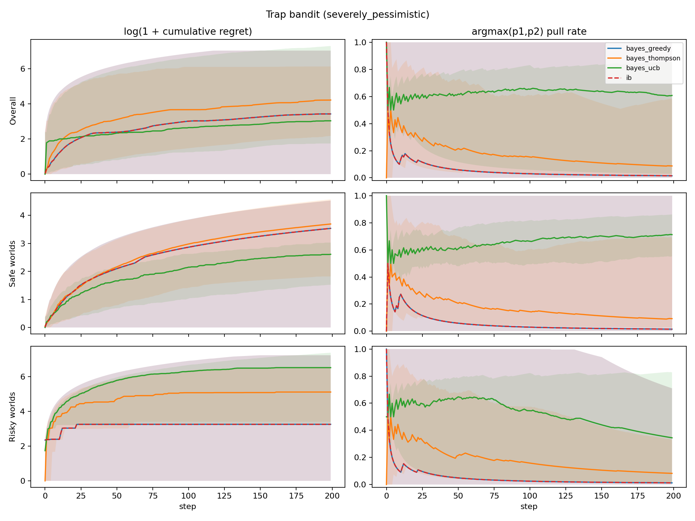

# Trap Bandit Experiment

Below we describe a simple experiment to demonstrate how a robust infra-Bayesian learner may be beneficial even in a stateless, stochastic bandit setting.

The details of our experiment are as follows. There are `K=2` possible arms to pull. There is a probability `alpha` of being in a risky world, and probability `1 - alpha` of being in a safe world.

At the beginning of a new run, p_1 and p_2 are newly sampled from a beta distribution. The world_type = {risky, safe} is also sampled.  In the safe world, each arm is Bernoulli and has fixed probability, `p_i`, of yielding reward `1`. In the risky world, the arm with the higher realized bias `p_i` is a three-sided die with a small probability `p_catastrophe` of yielding reward `-1000`; with probability `p_i`, it yields reward `1`; otherwise it yields reward `0`. The arm with the lower realized bias is still Bernoulli with reward = {1,0}.

```text
For each new run:
    sample alpha from the data-generating Beta distribution
    sample p1, p2 ~ Beta(2,2)
    sample world_type ~ Bernoulli(alpha)

    if safe world:
        arm i -> Bernoulli(p_i)

    if risky world:
        trapped_arm = argmax(p1, p2)
        trapped_arm -> reward -1000 (catastrophe) with probability 0.01
                        reward 1 with probability p_i
                        reward 0 otherwise
        other arm   -> Bernoulli(p_i)
```
Schema 1. Experiment world design.

We compare classical Bayesian agents and an infra-Bayesian agent using the same joint hypothesis machinery. Bayesian agents always use `Infradistribution.mix(...)`; the infra-Bayesian agent uses Knightian uncertainty over the safe-vs-risky world families via `Infradistribution.mixKU(...)`, while remaining classical/Bayesian (employing `Infradistribution.mix(...)`) over `p1,p2` within each family.

The Bayesian agent does not represent a full Beta prior over `alpha`. Instead, it receives a fixed point prior `P(risky) = E[alpha]` for the safe-vs-risky mixture: `0.5` for the correct condition, `2/7` for the mildly misspecified condition, `1/100` for the severely misspecified and mostly-safe conditions, and `99/100` for the severely pessimistic condition. This is because each agent acts within a single world, where `alpha` only induces the prior probability that the current world is risky; the variance of a population-level Beta prior over `alpha` would matter only for learning across many independently sampled worlds. By contrast, uncertainty over `p1,p2` is represented explicitly by a finite grid and updated from within-run observations.

In the first experiment, the Bayesian point prior on `P(risky)` matches the data-generating process in expectation, and the agent's `p1,p2` prior matches the data-generating distribution. In the next experiments, we run misspecified point-prior conditions where Bayesian agents put too little or too much probability on the risky world. Finally, in the mostly-safe experiment, we change the data-generating process to be mostly safe, such that the expected value maximizer would risk pulling the higher-reward arm. The infra-Bayesian agent always shares the same classical `p1,p2` prior as the Bayesian agent but maintains Knightian uncertainty over whether the world is safe or risky.

For Bayesian agents, we compare three exploration strategies:

- greedy,
- Thompson sampling,
- empirical UCB.

For the infra-Bayesian agent, we use greedy action selection over its robust lower values, with uniform tie-breaking.

Regret is measured against the best policy with full knowledge of the true world. We report cumulative expected regret percentiles and trapped-arm pull-rate percentiles.

## Results

The implementation is in `experiments/alaro/trap_bandit/` and the results were generated using the below configs:

```text
num_worlds = 100
num_steps = 200
num_grid = 7
p_cat = 0.01
```

Each result figure has six subplots. Columns are `log(1 + cumulative expected regret)` and `argmax(p1,p2)` pull rate. Rows are overall average, safe worlds, and risky worlds.


Figure 2a. Correct-prior results.

In the first experiment, the bayesian agent with a correctly specified prior has very similar behavior to the infra-bayesian agent, which maintains knightian uncertainty on whether it is in a risky world or not. They behave nearly identically in this setting because it is not favorable under this data generating process for an expected value maximizer to pull the risky arm. A key positive finding is that the infra-bayesian learner does properly learn which of the two arms is the risky one, at which point it can begin to behave safely. Notably, both non-greedy exploration strategies show significant regret in the risky worlds. 

Next, we examine two misspecified point priors for the probability that the world is risky.


Figure 2b. Misspecified-prior results.

In the first, slightly misspecified setting, the Bayesian agent uses point prior `P(risky)=2/7`, while the data-generating process has `E[alpha]=1/2`. Results between the Bayesian and infra-Bayesian agents diverge slightly but not significantly.


Figure 2c. Severely misspecified-prior results.

However, in the extremely misspecified setting, the Bayesian agent uses point prior `P(risky)=1/100`, while the data-generating process has `E[alpha]=1/2`. The Bayesian agent incurs significant regret by pulling the risky arm until it adjusts its posterior enough to reflect the actual world and begins to act more conservatively.

The severely pessimistic comparison uses Bayesian point prior `P(risky)=99/100` with the same data-generating process `E[alpha]=1/2`. This condition tests whether IB's advantage in the severely misspecified setting is genuinely about not needing to choose a pessimism level in advance, rather than merely showing that any sufficiently pessimistic expected-value agent behaves safely.



Figure 2d. Severely pessimistic-prior results.

In this condition, greedy Bayes and IB behave nearly identically because the Bayesian point prior is pessimistic enough that the risky branch dominates early action values. This supports the cleaner interpretation of IB's advantage: a sufficiently pessimistic Bayesian prior can also be safe, but IB does not require selecting that pessimism level in advance.

Finally, we change the data-generating process to be mostly safe, with `E[alpha]=1/100`, and show the results below.


Figure 2e. Mostly-safe correctly specified prior results.

Here, the infra-bayesian agent can be seen to drastically underperform in cumulative regret because of course it is maintaining knightian uncertainty about the high reward arm being risky.

# Summary

Across these experiments, infra-Bayes behaves conservatively in a way that protects it from not knowing whether the world is risky: when Bayes has a misspecified point prior that strongly underestimates risky worlds, greedy Bayes pulls the high-reward/high-risk arm more often and suffers worse regret, while IB's performance is stable. The severely pessimistic comparison is included to separate this from the weaker claim that any sufficiently pessimistic Bayesian point prior can also behave safely. With a correct or mildly misspecified point prior, greedy Bayes and IB are broadly similar in worlds where it "pays" to pull the guaranteed-safe arm. The tradeoff is clear in the mostly-safe, correctly specified setting (ie where it "pays" to pull the risky arm): Bayes exploits the high-reward arm and achieves much lower regret, while IB remains cautious because the risky-world hypothesis is still live.

The bootstrap CIs suggest caution about the strongest tail-regret claim at `N=100`: in the severely misspecified condition, greedy Bayes has higher p95 regret than IB, but the intervals overlap. The severely pessimistic condition clarifies the mechanism: a Bayesian agent can match IB's conservative behavior if initialized with a sufficiently pessimistic point prior, but that requires selecting the right pessimism level in advance. The mostly-safe condition shows the clearest cost of IB-style robustness, with non-overlapping p95 intervals favoring greedy Bayes.

# Appendix

Final cumulative expected-regret percentiles from `results_100_common_draws`. Brackets show 95% bootstrap CIs from 5000 resamples over worlds.

| condition | agent | catastrophe rate | p5, 95% CI | p50, 95% CI | p95, 95% CI |
| --- | --- | ---: | ---: | ---: | ---: |
| correct | bayes_greedy | 0.18 | 0.00 [0.00, 0.00] | 23.11 [9.93, 39.78] | 1139.28 [383.31, 1481.41] |
| correct | bayes_thompson | 0.33 | 5.05 [2.79, 8.88] | 38.19 [25.14, 158.04] | 1204.03 [1068.73, 1232.51] |
| correct | bayes_ucb | 0.38 | 4.73 [3.23, 7.16] | 19.86 [15.87, 228.99] | 1482.44 [1269.52, 1632.10] |
| correct | ib | 0.18 | 0.00 [0.00, 0.00] | 29.86 [13.44, 46.64] | 1139.28 [583.20, 1481.41] |
| misspecified | bayes_greedy | 0.18 | 0.00 [0.00, 0.00] | 23.11 [9.94, 39.65] | 1137.81 [383.31, 1481.41] |
| misspecified | bayes_thompson | 0.40 | 3.95 [2.40, 7.22] | 24.54 [15.17, 179.59] | 1491.57 [1033.40, 1596.82] |
| misspecified | bayes_ucb | 0.38 | 4.73 [3.23, 7.16] | 19.86 [15.87, 228.99] | 1482.44 [1269.52, 1632.10] |
| misspecified | ib | 0.18 | 0.00 [0.00, 0.00] | 29.86 [13.44, 46.64] | 1139.28 [583.20, 1481.41] |
| severely misspecified | bayes_greedy | 0.37 | 0.00 [0.00, 0.10] | 23.12 [9.79, 62.60] | 1829.15 [1159.85, 1929.36] |
| severely misspecified | bayes_thompson | 0.43 | 1.42 [0.94, 2.26] | 10.58 [6.53, 123.63] | 1625.97 [1048.35, 1826.89] |
| severely misspecified | bayes_ucb | 0.38 | 4.73 [3.23, 7.16] | 19.86 [15.87, 228.99] | 1482.44 [1269.52, 1632.10] |
| severely misspecified | ib | 0.18 | 0.00 [0.00, 0.00] | 29.86 [13.44, 46.64] | 1139.28 [583.20, 1481.41] |
| severely pessimistic | bayes_greedy | 0.18 | 0.00 [0.00, 0.00] | 29.86 [13.44, 46.64] | 1139.28 [592.19, 1481.41] |
| severely pessimistic | bayes_thompson | 0.14 | 7.85 [3.73, 12.43] | 67.09 [51.09, 83.18] | 459.12 [299.45, 691.94] |
| severely pessimistic | bayes_ucb | 0.38 | 4.73 [3.23, 7.16] | 19.86 [15.87, 228.99] | 1482.44 [1269.52, 1632.10] |
| severely pessimistic | ib | 0.18 | 0.00 [0.00, 0.00] | 29.86 [13.44, 46.64] | 1139.28 [583.20, 1481.41] |
| mostly safe correct | bayes_greedy | 0.00 | 0.00 [0.00, 0.00] | 0.67 [0.39, 1.12] | 23.66 [17.49, 46.29] |
| mostly safe correct | bayes_thompson | 0.00 | 0.83 [0.44, 1.34] | 3.91 [3.11, 4.81] | 12.53 [9.03, 14.18] |
| mostly safe correct | bayes_ucb | 0.00 | 1.99 [0.36, 3.21] | 10.62 [9.19, 11.85] | 16.55 [16.05, 17.41] |
| mostly safe correct | ib | 0.00 | 0.00 [0.00, 0.03] | 33.10 [18.50, 49.73] | 141.04 [112.54, 162.68] |
