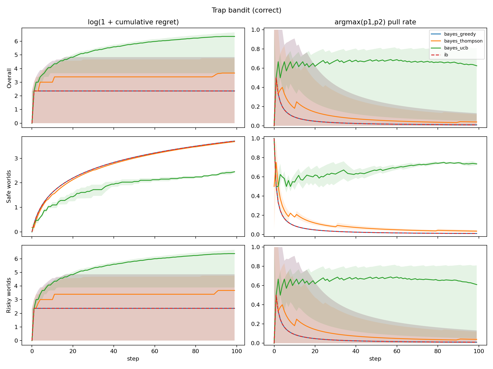
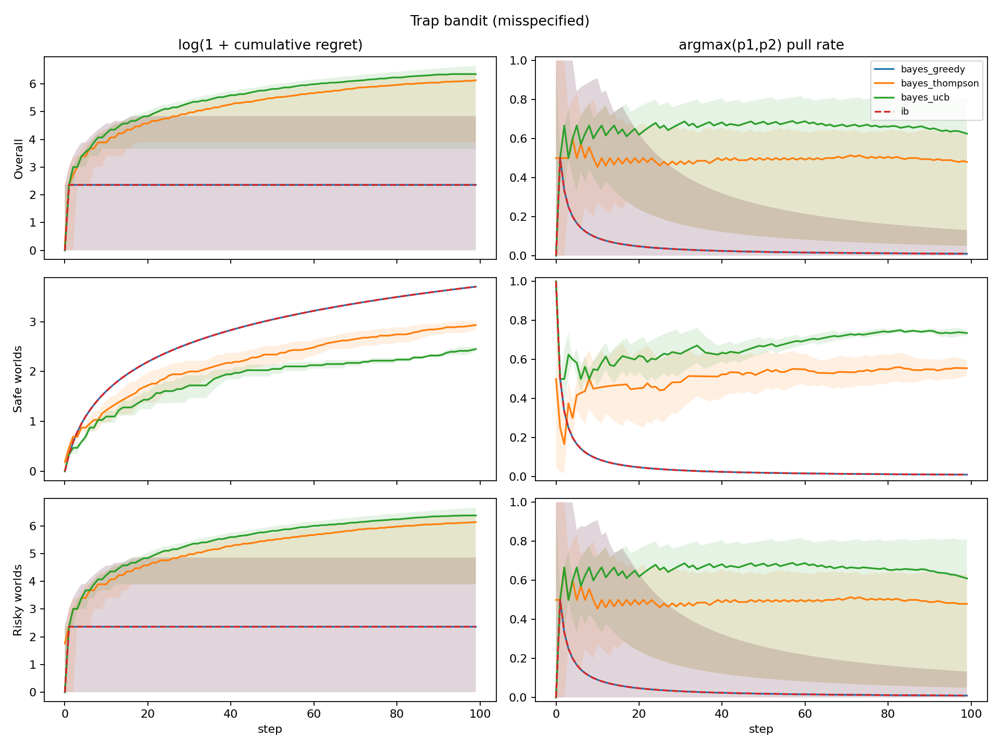
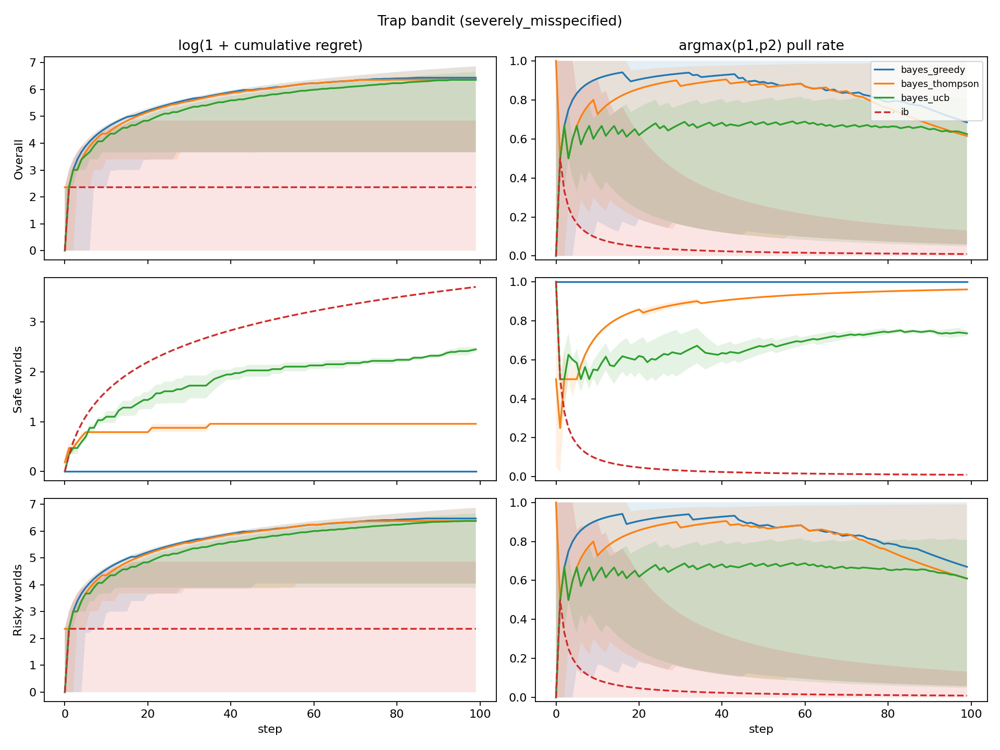
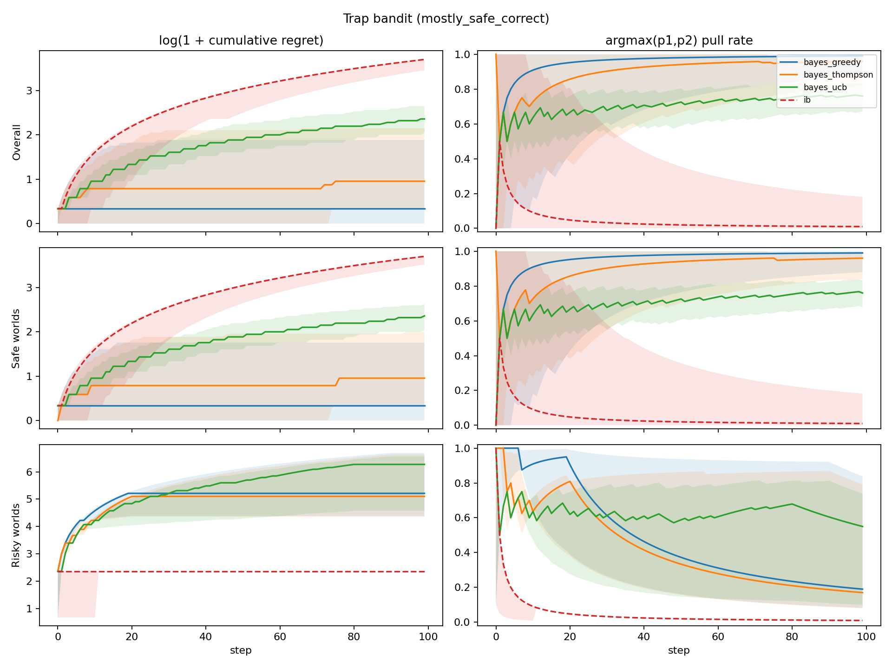
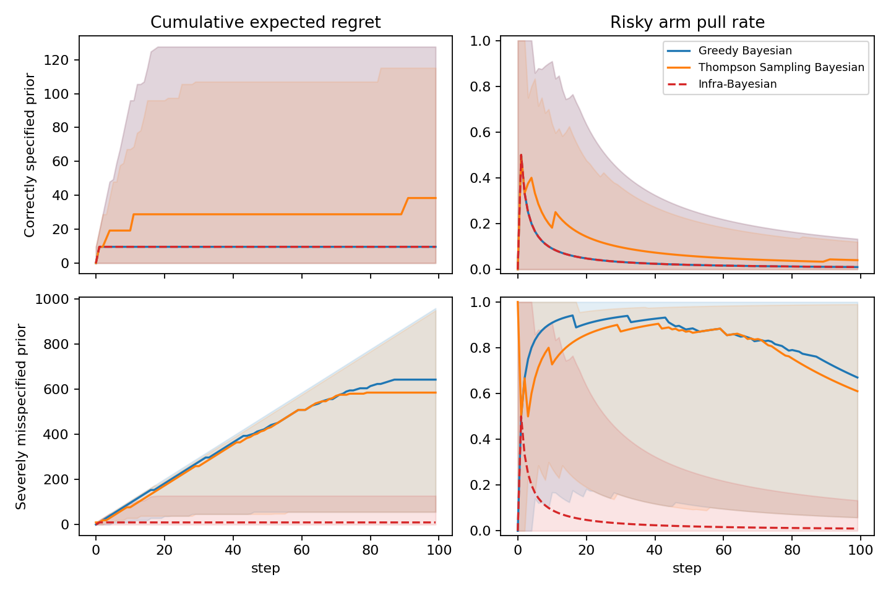

# Trap Bandit Experiment

Below we describe a simple experiment to demonstrate how a robust infra-Bayesian learner may be beneficial even in a stateless, stochastic bandit setting.

The details of our experiment are as follows. There are `K=2` possible arms to pull. There is a probability `alpha` of being in a risky world, and probability `1 - alpha` of being in a safe world.

At the beginning of a new run, `p_1` and `p_2` are newly assigned such that one arm has reward probability `0.3` and the other has reward probability `0.7`. The world_type = {risky, safe} is also sampled. In the safe world, each arm is Bernoulli and has fixed probability, `p_i={0.3,0.7}`, of yielding reward `1`. In the risky world, the arm with the 0.7 bias is a three-sided die with a small probability `p_catastrophe` of yielding reward `-1000`; with probability `0.7`, it yields reward `1`; otherwise it yields reward `0`. The arm with the lower realized bias is still Bernoulli with reward = `{1,0}`.

```text
For each new run:
    sample (p1, p2) uniformly from {(0.3, 0.7), (0.7, 0.3)}
    sample world_type ~ Bernoulli(P(risky))

    if safe world:
        arm i -> Bernoulli(p_i)

    if risky world:
        trapped_arm = argmax(p1, p2)
        trapped_arm -> reward -1000 with probability p_cat
                        reward 1 with probability p_i
                        reward 0 otherwise
        other arm   -> Bernoulli(p_i)
```
Schema 1. Experiment world design.

We compare classical Bayesian agents and an infra-Bayesian agent using the same joint hypothesis machinery. Bayesian agents always use `Infradistribution.mix(...)`; the infra-Bayesian agent uses Knightian uncertainty over the safe-vs-risky world families via `Infradistribution.mixKU(...)`, while continuing to use classical/Bayesian uncertainty (employing `Infradistribution.mix(...)`) over `p1,p2` within each family.

In the first experiment, the Bayesian point prior on `P(risky)` matches the data-generating process in expectation, and the agent's `p1,p2` prior matches the data-generating distribution. In the next experiments, we run misspecified point-prior conditions where Bayesian agents put too little probability on the risky world. Finally, in the mostly-safe experiment, we change the data-generating process to be mostly safe, such that the expected value maximizer would risk pulling the higher-reward arm. The infra-Bayesian agent always shares the same classical `p1,p2` prior as the Bayesian agent but maintains Knightian uncertainty over whether the world is safe or risky.

For Bayesian agents, we compare three exploration strategies:

- greedy,
- Thompson sampling,
- empirical UCB.

For the infra-Bayesian agent, we use greedy action selection over its robust lower values, with uniform tie-breaking.

Regret is measured against the best policy with full knowledge of the true world. We report cumulative expected regret percentiles and trapped-arm pull-rate percentiles.

## Results

The implementation is in `experiments/alaro/trap_bandit/` and the results were generated using the below configs:

```text
num_worlds = 200
num_steps = 100
p_low = 0.3
p_high = 0.7
p_cat = 0.01
```

Each result figure has six subplots. Columns are `log(1 + cumulative expected regret)` and `argmax(p1,p2)` pull rate. Rows are overall average, safe worlds, and risky worlds.



Figure 2a. Correct-prior results.

In the first experiment, the bayesian agent with a correctly specified prior has very similar behavior to the infra-bayesian agent, which maintains knightian uncertainty on whether it is in a risky world or not. They behave nearly identically in this setting because it is not favorable under this data generating process for an expected value maximizer to pull the risky arm. A key positive finding is that the infra-bayesian learner does properly learn which of the two arms is the risky one, at which point it can begin to behave safely. Notably, UCB shows significant regret in the risky worlds (and very low regret in the safe world).

Next, we examine two misspecified point priors for the probability that the world is risky.



Figure 2b. Misspecified-prior results.

In the first, slightly misspecified setting, the Bayesian agent uses point prior `P(risky)=0.5` (while the data-generating process still has `P(risky)=0.99`). The results of the greedy Bayesian agent does not change, because it still doesn't "pay" for a Bayesian agent to pull the risky arm even with this more modest prior. That said, the Bayesian agent who explores via Thompson sampling suffers significantly.



Figure 2c. Severely misspecified-prior results.

In the extremely misspecified setting, the Bayesian agent uses point prior `P(risky)=0.01` (while the data-generating process still has `P(risky)=0.99`). Now under the starting prior, it would "pay" to choose the risky arm. Thus, the Bayesian agent incurs significant regret by pulling the risky arm until it adjusts its posterior enough to reflect the actual world and begins to act more conservatively.

As a final experiment, we change the data-generating process to be mostly safe, with `P(risky)=0.01`, and show the results below.



Figure 2d. Mostly-safe correctly specified prior results.

Here, the infra-bayesian agent can be seen to drastically underperform in cumulative regret because, of course, it is maintaining knightian uncertainty about the high reward arm being risky. In a very safe world, this will come at a signficant cost. Additionally, one might note that the scale of regret is significantly lower in the safe worlds. Even a large relative cost in regret for an infra-bayesian agent in a world that turns out to be safe might be a small price to pay for the security, especially if one really has no way of specifying a reasonable prior a priori.

# Summary

Across these experiments, infra-Bayes behaves conservatively in a way that protects it from not knowing whether the world is risky: when Bayes has a misspecified point prior that strongly underestimates risky worlds, greedy Bayes pulls the high-reward/high-risk arm more often and suffers worse regret, while IB's performance is stable. With a correct or mildly misspecified point prior, greedy Bayes and IB are broadly similar in worlds where it "pays" to pull the guaranteed-safe arm. The tradeoff is clear in the mostly-safe, correctly specified setting (ie where it "pays" to pull the risky arm): Bayes exploits the high-reward arm and achieves much lower regret, while IB remains cautious because the risky-world hypothesis is still live.

The separated-arm setup makes this comparison cleaner than the broader beta-grid runs we demonstrated in previous commits. There are no near-tie worlds where the agent must infer tiny differences between arm probabilities; one arm is clearly high reward, and in risky worlds that same arm is trapped. This makes the strongest result easier to interpret: severe underestimation of risky worlds hurts Bayes, while IB remains stable.

# Appendix

Final cumulative expected-regret percentiles from `results_separated_arms_200_pcat001`. Brackets show 95% bootstrap CIs from 5000 resamples over worlds.

IB and UCB rows are not repeated across the three mostly-risky prior conditions because those agents do not depend on the Bayesian safe-vs-risky prior in this experiment. They are shown once for the mostly-risky DGP and again for the separate mostly-safe DGP. Rows are ordered by agent family: IB, UCB, all greedy Bayesian priors, all Thompson-sampling Bayesian priors, then the mostly-safe results in the same order.

| riskiness prior | agent | catastrophe rate | p5, 95% CI | p50, 95% CI | p95, 95% CI |
| --- | --- | ---: | ---: | ---: | ---: |
| n/a | infra_bayesian | 0.045 | 0.00 [0.00, 0.00] | 9.60 [9.60, 9.60] | 125.76 [105.60, 183.36] |
| n/a | bayes_ucb | 0.580 | 37.92 [19.20, 67.20] | 576.00 [470.40, 643.20] | 777.60 [768.00, 797.28] |
| correct | bayes_greedy | 0.045 | 0.00 [0.00, 0.00] | 9.60 [9.60, 9.60] | 125.76 [96.48, 183.36] |
| misspecified | bayes_greedy | 0.045 | 0.00 [0.00, 0.00] | 9.60 [9.60, 9.60] | 125.76 [96.48, 183.36] |
| severely misspecified | bayes_greedy | 0.645 | 37.92 [19.20, 85.44] | 624.00 [528.00, 748.80] | 960.00 [950.88, 960.00] |
| correct | bayes_thompson | 0.080 | 0.00 [0.00, 9.60] | 38.40 [28.80, 38.40] | 115.20 [96.00, 144.00] |
| misspecified | bayes_thompson | 0.500 | 48.00 [19.20, 66.24] | 460.80 [417.60, 499.20] | 604.80 [576.48, 614.40] |
| severely misspecified | bayes_thompson | 0.645 | 38.40 [9.60, 76.80] | 580.80 [489.60, 720.00] | 950.40 [940.80, 950.40] |
| mostly safe correct | infra_bayesian | 0.000 | 30.80 [27.52, 34.34] | 39.60 [39.60, 39.60] | 40.00 [40.00, 40.00] |
| mostly safe correct | bayes_ucb | 0.015 | 6.78 [6.40, 7.20] | 9.60 [9.20, 9.60] | 13.20 [12.40, 14.00] |
| mostly safe correct | bayes_greedy | 0.015 | 0.00 [0.00, 0.00] | 0.40 [0.40, 0.80] | 5.60 [4.02, 9.64] |
| mostly safe correct | bayes_thompson | 0.015 | 0.40 [0.00, 0.40] | 1.60 [1.20, 1.60] | 7.60 [5.22, 11.60] |



Figure 3. Risky-world comparison across Bayes priors. Rows are the correctly specified and severely misspecified Bayes prior conditions; columns are cumulative expected regret and high/trapped-arm pull rate. Each row compares Infra-Bayesian, greedy Bayesian, and Thompson-sampling Bayesian agents.

The table below is the subset corresponding to Figure 3. Values are final risky-world percentiles from the plotted summary bands.

| condition | agent | regret p5 | regret p50 | regret p95 | median high/trapped-arm pull rate |
| --- | --- | ---: | ---: | ---: | ---: |
| correct | infra_bayesian | 0.00 | 9.60 | 127.68 | 0.010 |
| correct | Greedy Bayesian | 0.00 | 9.60 | 127.68 | 0.010 |
| correct | Thompson Sampling Bayesian | 0.00 | 38.40 | 115.20 | 0.040 |
| severely misspecified | infra_bayesian | 0.00 | 9.60 | 127.68 | 0.010 |
| severely misspecified | Greedy Bayesian | 56.16 | 643.20 | 960.00 | 0.670 |
| severely misspecified | Thompson Sampling Bayesian | 56.16 | 585.60 | 950.40 | 0.610 |
