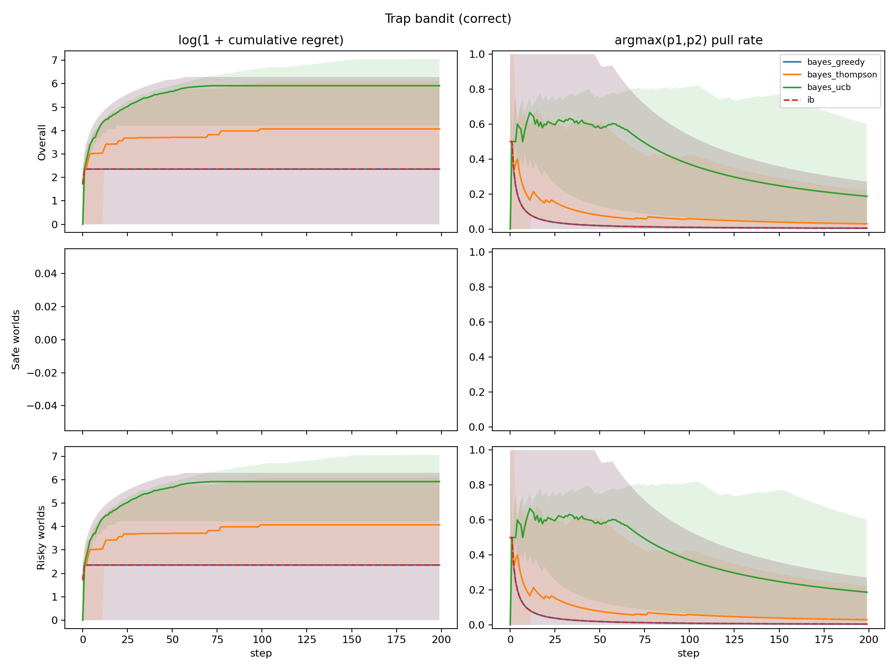
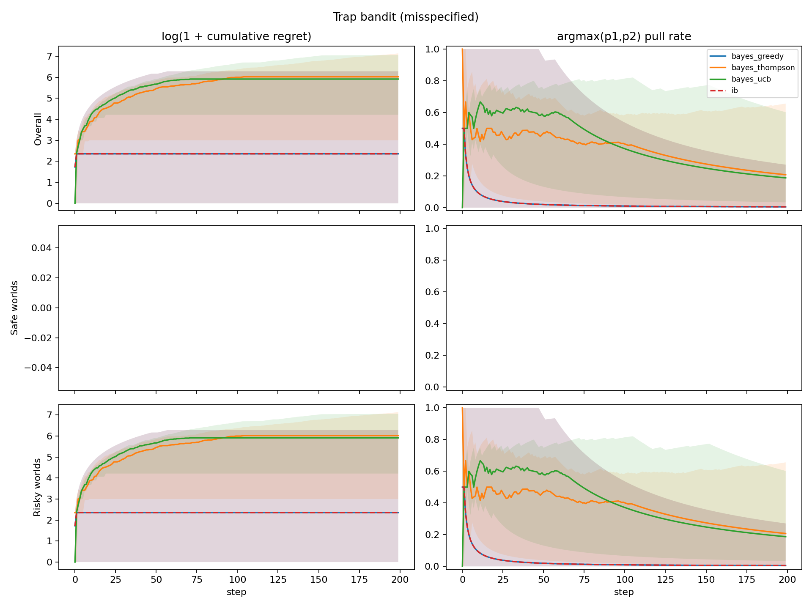
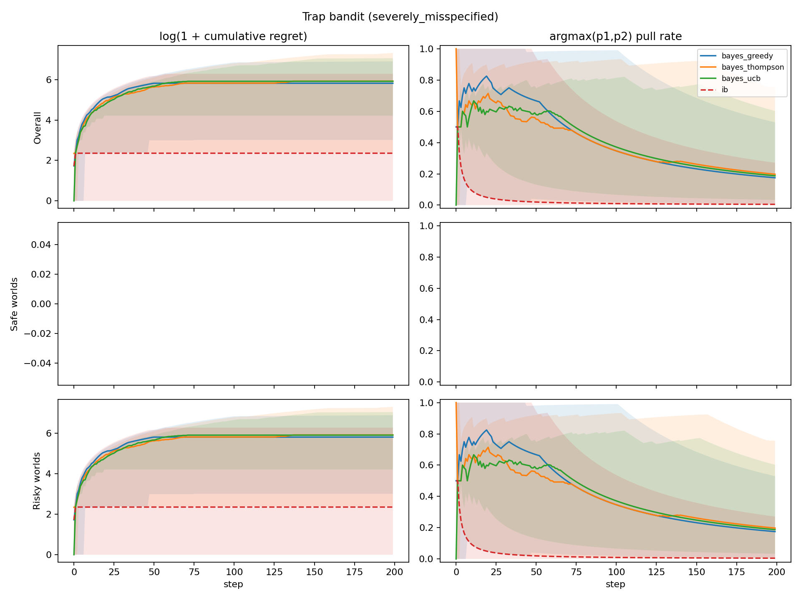
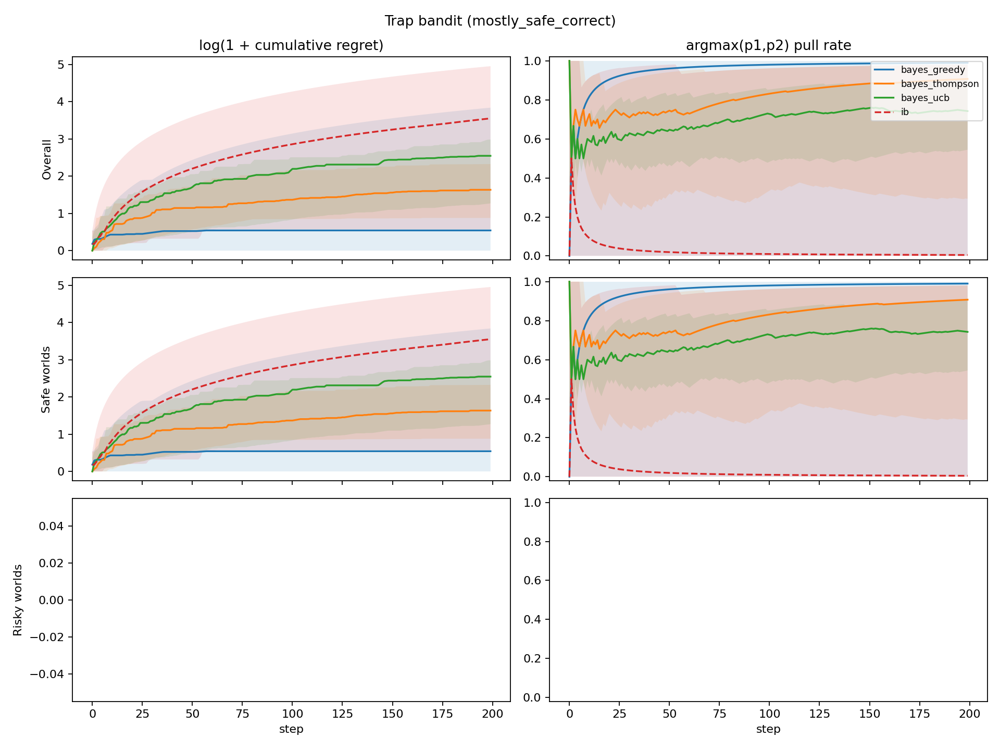

# Trap Bandit Mostly-Risky Experiment

Below we describe a quick mostly-risky variant of the trap-bandit experiment. This run returns to the original reward/catastrophe settings, but changes the first three conditions so that the data-generating process produces risky worlds with probability approximately `0.99`.

The details of our experiment are as follows. There are `K=2` possible arms to pull. There is a probability `alpha` of being in a risky world, and probability `1 - alpha` of being in a safe world.

At the beginning of a new run, p_1 and p_2 are newly sampled from a beta distribution. The world_type = {risky, safe} is also sampled.  In the safe world, each arm is Bernoulli and has fixed probability, `p_i`, of yielding reward `1`. In the risky world, the arm with the higher realized bias `p_i` is a three-sided die with a small probability `p_catastrophe` of yielding reward `-1000`; with probability `p_i`, it yields reward `1`; otherwise it yields reward `0`. The arm with the lower realized bias is still Bernoulli with reward = {1,0}.

```text
For each new run:
    sample alpha from the data-generating Beta distribution
    sample p1, p2 ~ Beta(2,2)
    sample world_type ~ Bernoulli(alpha)

    if safe world:
        arm i -> Bernoulli(p_i)

    if risky world:
        trapped_arm = argmax(p1, p2)
        trapped_arm -> reward -1000 (catastrophe) with probability 0.01
                        reward 1 with probability p_i
                        reward 0 otherwise
        other arm   -> Bernoulli(p_i)
```
Schema 1. Experiment world design.

We compare classical Bayesian agents and an infra-Bayesian agent using the same joint hypothesis machinery. Bayesian agents always use `Infradistribution.mix(...)`; the infra-Bayesian agent uses Knightian uncertainty over the safe-vs-risky world families via `Infradistribution.mixKU(...)`, while remaining classical/Bayesian (employing `Infradistribution.mix(...)`) over `p1,p2` within each family.

The Bayesian agent does not represent a full Beta prior over `alpha`. Instead, it receives a fixed point prior `P(risky) = E[alpha]` for the safe-vs-risky mixture: `0.99` for the correct mostly-risky condition, `0.5` for the moderately misspecified condition, `0.01` for the severely misspecified condition, and `0.01` for the mostly-safe condition. This is because each agent acts within a single world, where `alpha` only induces the prior probability that the current world is risky; the variance of a population-level Beta prior over `alpha` would matter only for learning across many independently sampled worlds. By contrast, uncertainty over `p1,p2` is represented explicitly by a finite grid and updated from within-run observations.

In the first experiment, the Bayesian point prior on `P(risky)` matches the mostly-risky data-generating process. In the next two experiments, Bayesian agents increasingly underestimate how likely risky worlds are. Finally, in the mostly-safe experiment, we keep the original mostly-safe comparison unchanged, such that the expected value maximizer would risk pulling the higher-reward arm. The infra-Bayesian agent always shares the same classical `p1,p2` prior as the Bayesian agent but maintains Knightian uncertainty over whether the world is safe or risky.

For Bayesian agents, we compare three exploration strategies:

- greedy,
- Thompson sampling,
- empirical UCB.

For the infra-Bayesian agent, we use greedy action selection over its robust lower values, with uniform tie-breaking.

Regret is measured against the best policy with full knowledge of the true world. We report cumulative expected regret percentiles and trapped-arm pull-rate percentiles.

## Results

The implementation is in `experiments/alaro/trap_bandit/` and the results were generated using the below configs:

```text
num_worlds = 20
num_steps = 200
num_grid = 7
p_cat = 0.01
p_beta = (2, 2)
condition_preset = mostly_risky
```

Each result figure has six subplots. Columns are `log(1 + cumulative expected regret)` and `argmax(p1,p2)` pull rate. Rows are overall average, safe worlds, and risky worlds.



Figure 2a. Correct-prior results.

In the first experiment, the Bayesian agent has the correct point prior `P(risky)=0.99`. Greedy Bayes and IB behave identically in this quick run: both are already conservative enough to avoid much of the trapped-arm risk, while UCB explores too aggressively and pays high regret.

Next, we examine two misspecified point priors for the probability that the world is risky.



Figure 2b. Misspecified-prior results.

In the first misspecified setting, the Bayesian agent uses point prior `P(risky)=0.5`, while the data-generating process has `E[alpha]=0.99`. Greedy Bayes and IB still match in this run, suggesting that this level of misspecification is not enough to change greedy action choice under these parameters.



Figure 2c. Severely misspecified-prior results.

However, in the extremely misspecified setting, the Bayesian agent uses point prior `P(risky)=0.01`, while the data-generating process has `E[alpha]=0.99`. Here greedy Bayes incurs much higher catastrophe rate and regret than IB in this small run, because it initially treats the trapped-arm hypothesis as very unlikely.

Finally, we change the data-generating process to be mostly safe, with `E[alpha]=1/100`, and show the results below.



Figure 2d. Mostly-safe correctly specified prior results.

Here, the infra-bayesian agent can be seen to drastically underperform in cumulative regret because of course it is maintaining knightian uncertainty about the high reward arm being risky.

# Summary

At `N=20`, this run is only a quick check, but the qualitative story is useful. When the Bayesian point prior is correct at `P(risky)=0.99`, greedy Bayes and IB match. When Bayes moderately underestimates risk at `P(risky)=0.5`, greedy Bayes still matches IB under these parameters. When Bayes severely underestimates risk at `P(risky)=0.01`, greedy Bayes has much higher catastrophe rate and regret than IB. The mostly-safe condition remains the robustness-cost case: greedy Bayes exploits more freely, while IB remains cautious because the risky-world hypothesis is still live.

The bootstrap intervals are very wide with only 20 worlds, especially for p95 regret, so these numbers should be treated as a story check rather than evidence. If this behavior is interesting, the next step is to rerun the same preset with more worlds.

# Appendix

Final cumulative expected-regret percentiles from `results_mostly_risky_20`. Brackets show 95% bootstrap CIs from 5000 resamples over worlds.

| condition | agent | catastrophe rate | p5, 95% CI | p50, 95% CI | p95, 95% CI |
| --- | --- | ---: | ---: | ---: | ---: |
| correct | bayes_greedy | 0.25 | 0.00 [0.00, 0.00] | 9.55 [0.00, 19.89] | 535.86 [42.61, 578.76] |
| correct | bayes_thompson | 0.40 | 9.88 [9.80, 36.77] | 57.61 [38.21, 97.68] | 441.79 [113.44, 489.92] |
| correct | bayes_ucb | 0.95 | 66.75 [9.89, 215.40] | 369.64 [269.36, 454.38] | 1161.49 [518.80, 1586.38] |
| correct | ib | 0.25 | 0.00 [0.00, 0.00] | 9.55 [0.00, 19.89] | 535.86 [42.61, 578.76] |
| misspecified | bayes_greedy | 0.25 | 0.00 [0.00, 0.00] | 9.55 [0.00, 19.89] | 535.86 [42.61, 578.76] |
| misspecified | bayes_thompson | 0.85 | 19.11 [9.89, 92.51] | 412.17 [190.53, 623.74] | 1257.05 [667.65, 1354.91] |
| misspecified | bayes_ucb | 0.95 | 66.75 [9.89, 215.40] | 369.64 [269.36, 454.38] | 1161.49 [518.80, 1586.38] |
| misspecified | ib | 0.25 | 0.00 [0.00, 0.00] | 9.55 [0.00, 19.89] | 535.86 [42.61, 578.76] |
| severely misspecified | bayes_greedy | 0.85 | 19.36 [9.89, 69.19] | 335.32 [133.50, 530.23] | 992.36 [569.08, 1901.74] |
| severely misspecified | bayes_thompson | 0.80 | 9.93 [9.89, 171.40] | 373.47 [217.53, 912.77] | 1500.03 [926.07, 1796.62] |
| severely misspecified | bayes_ucb | 0.95 | 66.75 [9.89, 215.40] | 369.64 [269.36, 454.38] | 1161.49 [518.80, 1586.38] |
| severely misspecified | ib | 0.25 | 0.00 [0.00, 0.00] | 9.55 [0.00, 19.89] | 535.86 [42.61, 578.76] |
| mostly safe correct | bayes_greedy | 0.00 | 0.00 [0.00, 0.27] | 0.72 [0.34, 3.52] | 45.60 [6.15, 46.09] |
| mostly safe correct | bayes_thompson | 0.00 | 1.41 [1.39, 2.69] | 4.13 [2.81, 5.21] | 9.24 [5.96, 13.90] |
| mostly safe correct | bayes_ucb | 0.00 | 2.56 [1.14, 8.02] | 11.78 [8.44, 14.57] | 18.78 [15.12, 19.29] |
| mostly safe correct | ib | 0.00 | 0.77 [0.39, 4.68] | 33.93 [15.65, 66.47] | 141.06 [71.10, 149.86] |
