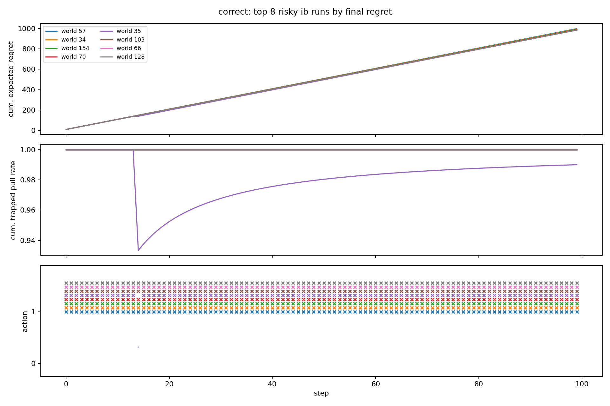
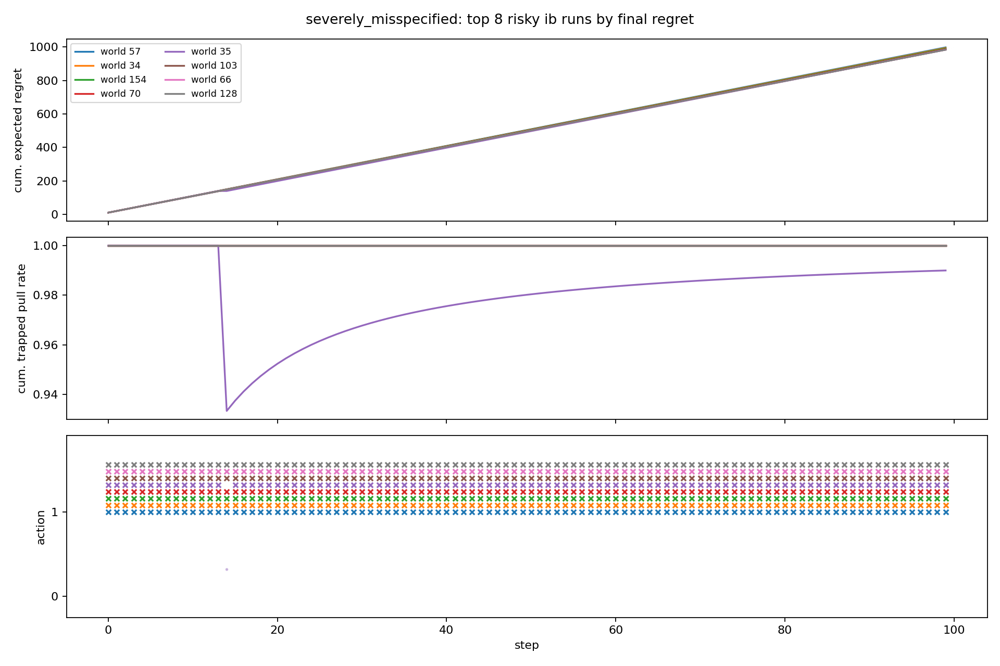
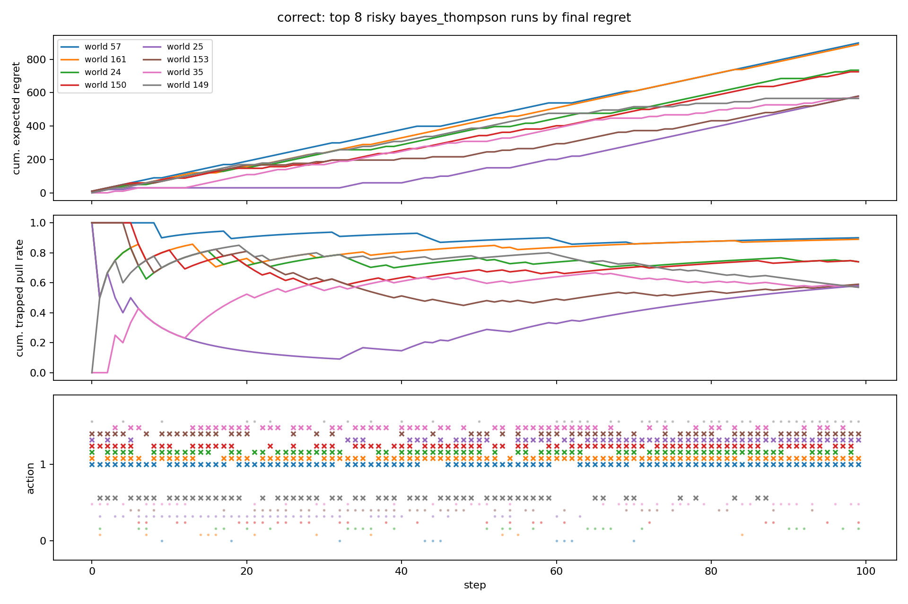
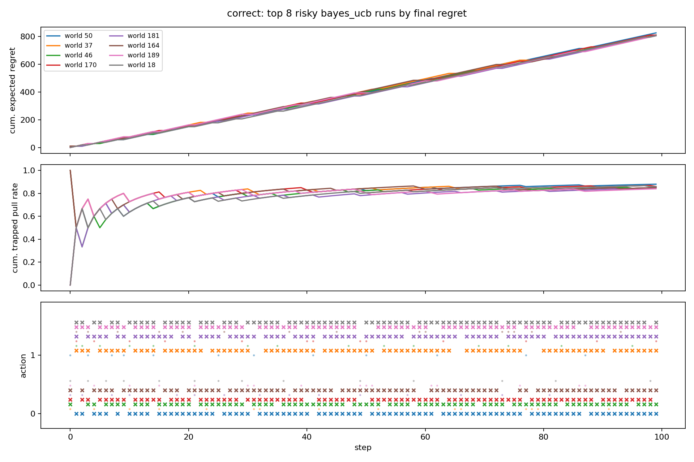

# Trap Bandit Individual-Run Diagnostics

These diagnostics inspect cached individual trajectories from `results_mostly_risky_200_pcat001_grid7`. They focus on risky worlds with the highest final cumulative expected regret.

Each figure shows:

- cumulative expected regret,
- cumulative trapped-arm pull rate,
- action traces, where `x` marks trapped-arm pulls and `*` marks realized catastrophes.

## Infra-Bayes, Correct Prior Condition

In the worst IB risky-world runs, the agent pulls the trapped arm almost every step. These runs have high expected regret but no realized catastrophes, which suggests the failure mode is posterior/action lock-in to the wrong arm rather than realized catastrophe loss.

## Infra-Bayes, Severely Misspecified Bayes Condition

IB is unchanged across Bayesian-prior conditions, so this figure matches the correct-prior IB diagnosis. The same top-regret risky worlds are cases where IB persistently chooses the trapped arm.

## Thompson Sampling, Correct Prior Condition

Thompson sampling also has high-regret risky-world failures, but its worst runs generally pull the trapped arm less persistently than IB's worst runs. This helps explain why Thompson sampling can have lower p95 regret despite worse average exploration risk.

## UCB, Correct Prior Condition

UCB explores heavily, so it often pulls the trapped arm. Its worst runs are not as fully locked in as the worst IB runs, but the algorithm pays substantial exploration cost across many worlds.

## Takeaway

The surprising high upper-tail regret for IB is not primarily from initial random pulls. In the worst risky-world runs, IB becomes confident enough to repeatedly choose the trapped arm, apparently because it has misidentified which arm is safe. A conservative greedy agent still needs some conservative information-gathering mechanism if the identity of the safe arm is uncertain.
