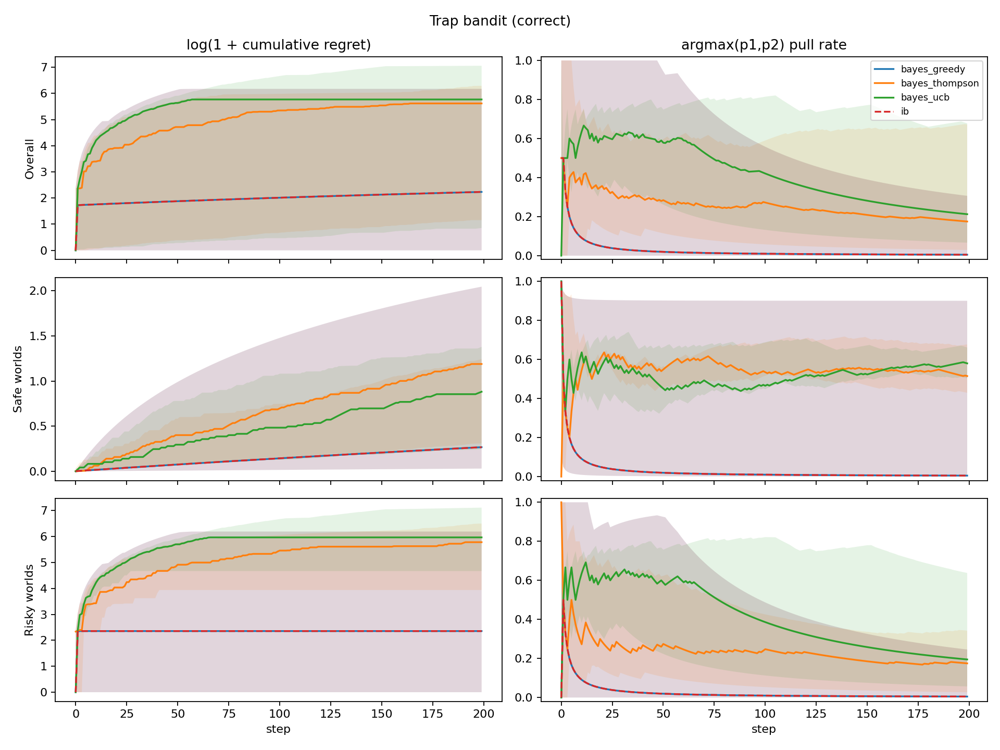
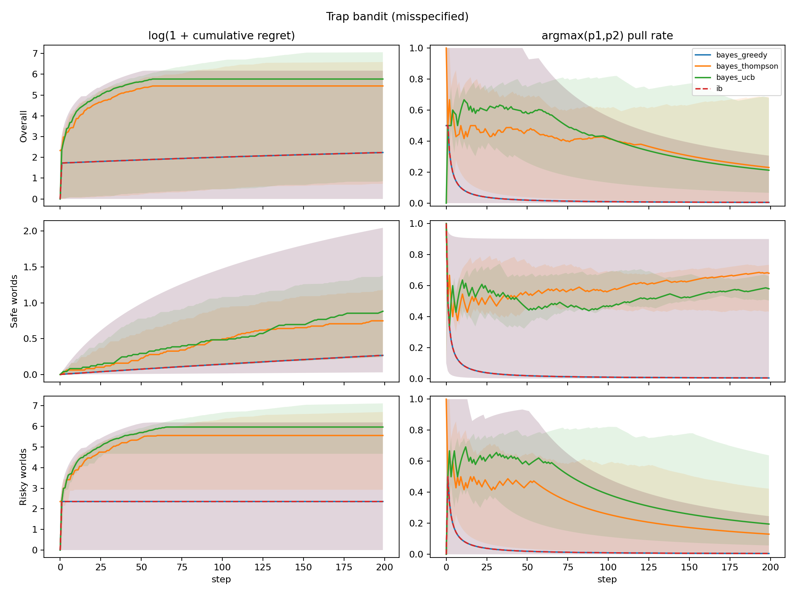
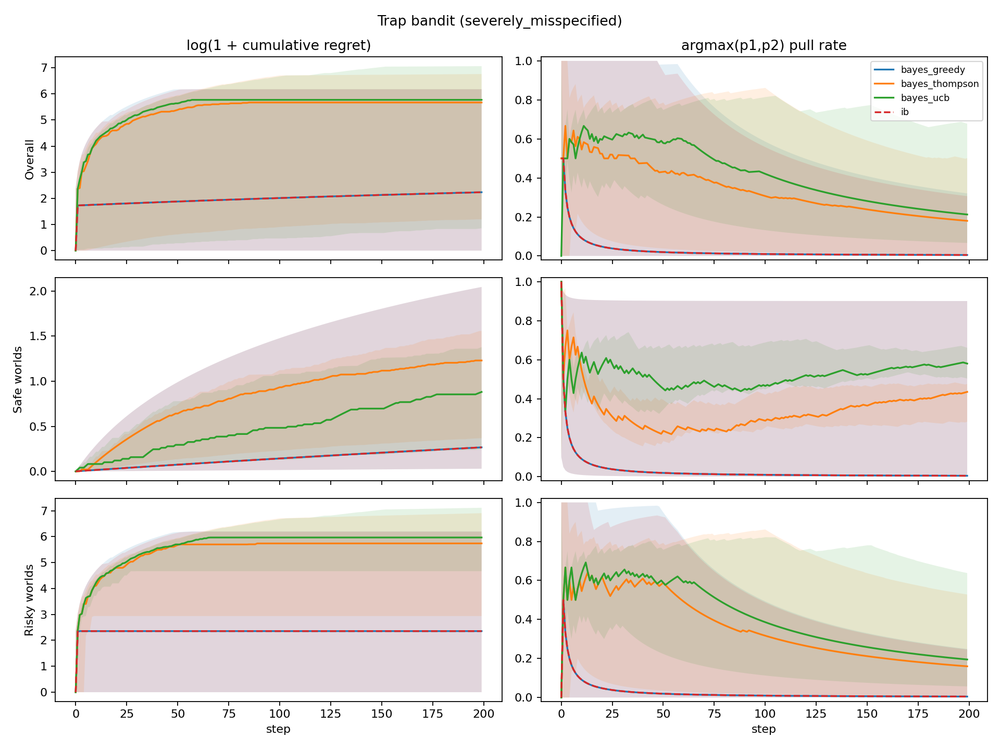
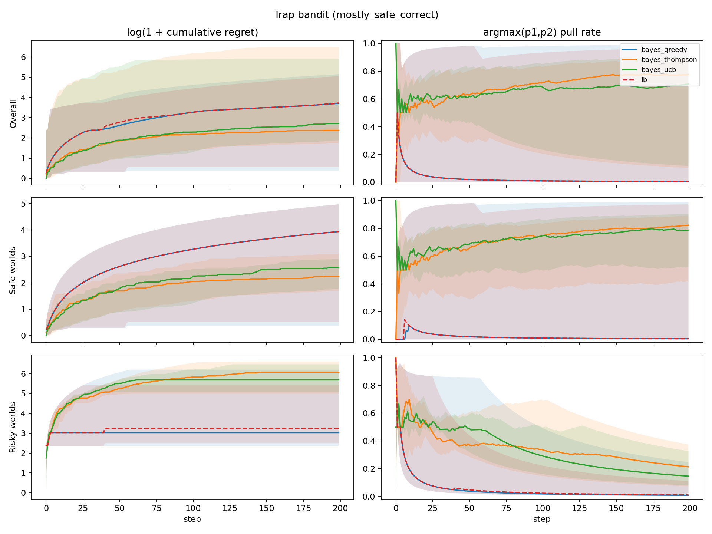

# Trap Bandit Risky-80 Experiment

Below we describe a quick risky-80 variant of the trap-bandit experiment. This run returns to the original reward/catastrophe settings, but changes the first three conditions so that the data-generating process produces risky worlds with probability approximately `0.8`.

The details of our experiment are as follows. There are `K=2` possible arms to pull. There is a probability `alpha` of being in a risky world, and probability `1 - alpha` of being in a safe world.

At the beginning of a new run, p_1 and p_2 are newly sampled from a beta distribution. The world_type = {risky, safe} is also sampled.  In the safe world, each arm is Bernoulli and has fixed probability, `p_i`, of yielding reward `1`. In the risky world, the arm with the higher realized bias `p_i` is a three-sided die with a small probability `p_catastrophe` of yielding reward `-1000`; with probability `p_i`, it yields reward `1`; otherwise it yields reward `0`. The arm with the lower realized bias is still Bernoulli with reward = {1,0}.

```text
For each new run:
    sample alpha from the data-generating Beta distribution
    sample p1, p2 ~ Beta(2,2)
    sample world_type ~ Bernoulli(alpha)

    if safe world:
        arm i -> Bernoulli(p_i)

    if risky world:
        trapped_arm = argmax(p1, p2)
        trapped_arm -> reward -1000 (catastrophe) with probability 0.01
                        reward 1 with probability p_i
                        reward 0 otherwise
        other arm   -> Bernoulli(p_i)
```
Schema 1. Experiment world design.

We compare classical Bayesian agents and an infra-Bayesian agent using the same joint hypothesis machinery. Bayesian agents always use `Infradistribution.mix(...)`; the infra-Bayesian agent uses Knightian uncertainty over the safe-vs-risky world families via `Infradistribution.mixKU(...)`, while remaining classical/Bayesian (employing `Infradistribution.mix(...)`) over `p1,p2` within each family.

The Bayesian agent does not represent a full Beta prior over `alpha`. Instead, it receives a fixed point prior `P(risky) = E[alpha]` for the safe-vs-risky mixture: `0.8` for the correct risky-80 condition, `0.5` for the moderately misspecified condition, `0.2` for the severely misspecified condition, and `0.2` for the mostly-safe condition. This is because each agent acts within a single world, where `alpha` only induces the prior probability that the current world is risky; the variance of a population-level Beta prior over `alpha` would matter only for learning across many independently sampled worlds. By contrast, uncertainty over `p1,p2` is represented explicitly by a finite grid and updated from within-run observations.

In the first experiment, the Bayesian point prior on `P(risky)` matches the risky-80 data-generating process. In the next two experiments, Bayesian agents increasingly underestimate how likely risky worlds are. Finally, in the mostly-safe experiment, we set the data-generating process and Bayesian prior to `P(risky)=0.2`. The infra-Bayesian agent always shares the same classical `p1,p2` prior as the Bayesian agent but maintains Knightian uncertainty over whether the world is safe or risky.

For Bayesian agents, we compare three exploration strategies:

- greedy,
- Thompson sampling,
- empirical UCB.

For the infra-Bayesian agent, we use greedy action selection over its robust lower values, with uniform tie-breaking.

Regret is measured against the best policy with full knowledge of the true world. We report cumulative expected regret percentiles and trapped-arm pull-rate percentiles.

## Results

The implementation is in `experiments/alaro/trap_bandit/` and the results were generated using the below configs:

```text
num_worlds = 20
num_steps = 200
num_grid = 7
p_cat = 0.01
p_beta = (2, 2)
condition_preset = risky_80
```

Each result figure has six subplots. Columns are `log(1 + cumulative expected regret)` and `argmax(p1,p2)` pull rate. Rows are overall average, safe worlds, and risky worlds.



Figure 2a. Correct-prior results.

In the first experiment, the Bayesian agent has the correct point prior `P(risky)=0.8`. Greedy Bayes and IB behave identically in this quick run: both are already conservative enough to avoid much of the trapped-arm risk, while UCB explores too aggressively and pays high regret.

Next, we examine two misspecified point priors for the probability that the world is risky.



Figure 2b. Misspecified-prior results.

In the first misspecified setting, the Bayesian agent uses point prior `P(risky)=0.5`, while the data-generating process has `E[alpha]=0.8`. Greedy Bayes and IB still match in this run, suggesting that this level of misspecification is not enough to change greedy action choice under these parameters.



Figure 2c. Severely misspecified-prior results.

However, in the most misspecified setting, the Bayesian agent uses point prior `P(risky)=0.2`, while the data-generating process has `E[alpha]=0.8`. In this small run, that is still conservative enough that greedy Bayes behaves almost identically to IB.

Finally, we change the data-generating process to be mostly safe, with `E[alpha]=0.2`, and show the results below.



Figure 2d. Mostly-safe correctly specified prior results.

Here, the infra-bayesian agent can be seen to drastically underperform in cumulative regret because of course it is maintaining knightian uncertainty about the high reward arm being risky.

# Summary

At `N=20`, this run is only a quick check. With Bayes priors `P(risky)=0.8`, `0.5`, and `0.2`, greedy Bayes and IB are almost identical under the risky-80 DGP. This suggests `P(risky)=0.2` is still pessimistic enough, given these rewards, to avoid the failure mode that appeared at `P(risky)=0.01`. The mostly-safe `P(risky)=0.2` condition is also less clean as a robustness-cost case than the old `0.01` setting: risky worlds happen often enough that Bayes can also pay tail regret.

The bootstrap intervals are very wide with only 20 worlds, especially for p95 regret, so these numbers should be treated as a story check rather than evidence. If this behavior is interesting, the next step is to rerun the same preset with more worlds.

# Appendix

Final cumulative expected-regret percentiles from `results_risky80_20`. Brackets show 95% bootstrap CIs from 5000 resamples over worlds.

| condition | agent | catastrophe rate | p5, 95% CI | p50, 95% CI | p95, 95% CI |
| --- | --- | ---: | ---: | ---: | ---: |
| correct | bayes_greedy | 0.20 | 0.00 [0.00, 0.00] | 8.34 [0.00, 9.93] | 479.12 [30.30, 533.60] |
| correct | bayes_thompson | 0.60 | 2.18 [0.15, 55.50] | 274.35 [134.91, 353.29] | 538.30 [389.06, 1324.12] |
| correct | bayes_ucb | 0.80 | 1.35 [0.15, 132.10] | 319.37 [177.22, 454.38] | 1161.49 [518.80, 1586.38] |
| correct | ib | 0.20 | 0.00 [0.00, 0.00] | 8.34 [0.00, 9.93] | 479.12 [30.30, 533.60] |
| misspecified | bayes_greedy | 0.20 | 0.00 [0.00, 0.00] | 8.34 [0.00, 9.93] | 479.12 [30.30, 533.60] |
| misspecified | bayes_thompson | 0.80 | 1.07 [0.18, 19.59] | 228.67 [57.75, 523.64] | 724.79 [608.56, 1251.90] |
| misspecified | bayes_ucb | 0.80 | 1.35 [0.15, 132.10] | 319.37 [177.22, 454.38] | 1161.49 [518.80, 1586.38] |
| misspecified | ib | 0.20 | 0.00 [0.00, 0.00] | 8.34 [0.00, 9.93] | 479.12 [30.30, 533.60] |
| severely misspecified | bayes_greedy | 0.20 | 0.00 [0.00, 0.00] | 8.34 [0.00, 9.93] | 480.60 [30.30, 563.24] |
| severely misspecified | bayes_thompson | 0.80 | 2.31 [0.23, 19.86] | 288.59 [74.82, 386.22] | 858.91 [467.20, 1720.17] |
| severely misspecified | bayes_ucb | 0.80 | 1.35 [0.15, 132.10] | 319.37 [177.22, 454.38] | 1161.49 [518.80, 1586.38] |
| severely misspecified | ib | 0.20 | 0.00 [0.00, 0.00] | 8.34 [0.00, 9.93] | 479.12 [30.30, 533.60] |
| mostly safe correct | bayes_greedy | 0.05 | 0.47 [0.39, 9.97] | 39.61 [15.73, 69.83] | 171.06 [87.30, 573.71] |
| mostly safe correct | bayes_thompson | 0.20 | 4.78 [3.36, 8.16] | 9.76 [8.43, 19.08] | 654.55 [32.95, 757.08] |
| mostly safe correct | bayes_ucb | 0.20 | 5.58 [2.64, 8.50] | 14.10 [10.24, 16.40] | 363.80 [25.04, 698.09] |
| mostly safe correct | ib | 0.00 | 0.77 [0.39, 15.33] | 40.40 [17.83, 69.83] | 155.23 [79.73, 257.18] |
